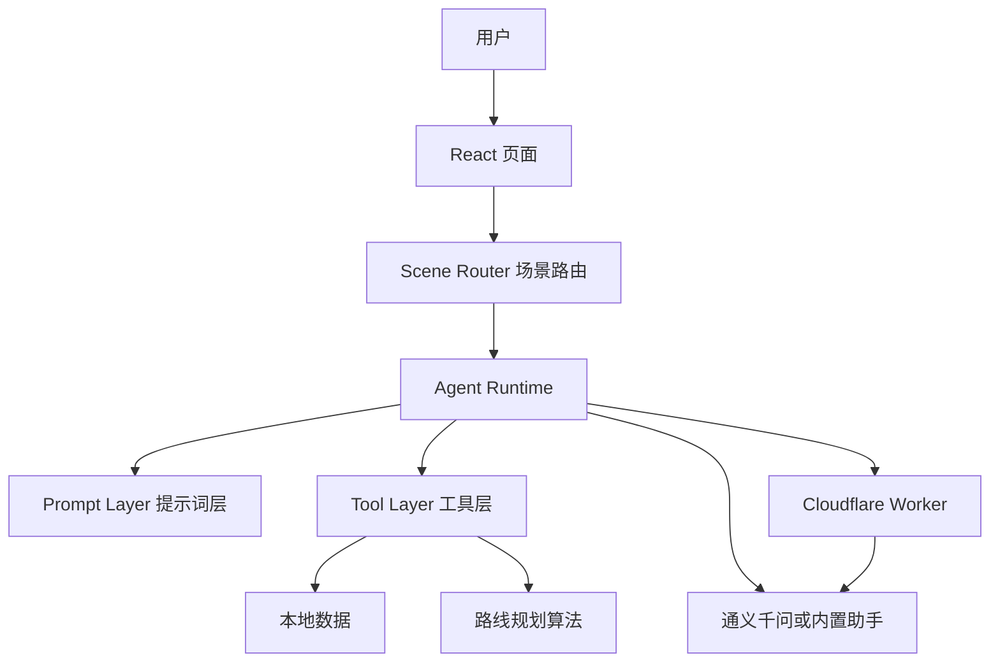

# 北林智能旅行 · 系统架构

本文档描述 `bfu-smart-travel` 当前的代码结构、Agent 调用流程、数据边界和后续扩展规则。

## 1. 架构定位

本项目是一个以北京林业大学校园游览为核心的单页应用，技术栈为：

- React：页面组件和交互状态
- TypeScript：类型约束和业务逻辑
- Vite：开发服务器和生产构建
- Cloudflare Worker：统一的 AI 接口代理
- GitHub Pages：静态网站部署

Agent 目前采用：

```text
单 Agent
    + 场景路由
    + 场景专用提示词
    + 场景专用工具子集
    + 本地路线算法
    + 仅网络不可达时的内置助手兜底
```

它不是多个模型互相协作的完整多 Agent 系统。不同场景可以共用同一个模型，但运行时会使用不同的提示词、工具和上下文。

## 2. 总体架构



一次请求的基本顺序是：

```text
用户输入
  ↓
识别场景
  ↓
加载该场景的提示词和工具
  ↓
模型理解需求，决定是否调用工具
  ↓
前端执行本地工具
  ↓
把工具结果返回给模型
  ↓
模型组织最终回答
  ↓
页面同步路线、点位和上下文
```

## 3. 目录与职责

```text
src/
├─ App.tsx                    页面总框架和全局状态
├─ components/                React 页面组件
│  ├─ AgentPanel.tsx           AI 对话窗口
│  ├─ Planner.tsx              手动路线规划器
│  ├─ RouteResult.tsx          路线结果和路线编辑
│  ├─ CampusMap.tsx            SVG 校园地图
│  ├─ SpotDetail.tsx           点位详情
│  ├─ SpotsGallery.tsx         点位图鉴
│  ├─ Trips.tsx                周边线路
│  └─ Checklist.tsx            出行清单
├─ data/                      静态数据层
│  ├─ spots.ts                 校园点位
│  ├─ trips.ts                 校外线路
│  ├─ interests.ts             兴趣、时长、步速和门岗
│  └─ campusGeometry.ts        校园地图几何数据
├─ prompts/                   提示词层
│  ├─ basePrompt.ts            所有场景共享的规则
│  └─ scenePrompts.ts          各场景的职责和边界
├─ agent/                     Agent 核心层
│  ├─ config.ts                千问 Worker 默认配置
│  ├─ types.ts                 Agent设置、历史和工具上下文类型
│  ├─ runtime.ts               Agent总调度和结果整理
│  ├─ network.ts               模型请求和连接测试
│  ├─ errors.ts                错误和连接结果格式化
│  ├─ history.ts               对话历史裁剪
│  ├─ toolLoop.ts              工具调用循环
│  └─ transports/              Chat Completions协议适配
├─ lib/                       业务逻辑层
│  ├─ agent.ts                 兼容入口，重新导出 Agent 核心层
│  ├─ localAgent.ts            无密钥时的规则助手
│  ├─ sceneRouter.ts           场景识别和工具白名单
│  ├─ toolSchemas.ts           工具参数定义
│  ├─ toolExecutor.ts          工具执行和数据查询
│  ├─ planner.ts               路线规划算法
│  └─ storage.ts               localStorage 状态保存
└─ styles/global.css           全局样式

worker/
└─ openai-proxy.js             千问 AI 服务端代理
```

## 4. Agent 场景路由

场景路由位于 `src/lib/sceneRouter.ts`。它先判断用户当前问题属于哪个场景，再决定模型可以看到哪些工具。

| 场景 | 作用 | 可用工具 |
| --- | --- | --- |
| `campus-route` | 规划或调整校园路线 | `list_spots`、`build_route` |
| `spot-detail` | 讲解校园点位 | `list_spots`、`get_spot_detail` |
| `outside-trip` | 推荐学校周边和校外线路 | `suggest_trip` |
| `weather` | 查询指定地点的天气和出行条件 | `get_weather` |
| `system-help` | 说明使用方法和连接设置 | 无 |
| `unknown` | 场景不明确，先询问用户 | 无 |

场景隔离的目的有两个：

1. 避免校园路线和校外旅行互相干扰。
2. 减少模型面对的工具数量，提高工具选择准确率。

例如，点位讲解场景不应该直接调用校外线路工具；校外旅行场景也不应该把颐和园当成校园点位。

## 5. 提示词、工具和数据的边界

### 提示词层

提示词规定“如何工作”，包括：

- Agent 的身份
- 当前场景的职责
- 什么时候调用工具
- 哪些信息不能编造
- 最终回答的组织方式

提示词不应该写死所有景点名称、预算和坐标。

### 工具层

工具把模型的自然语言需求转换为确定性的程序操作：

天气工具是工具层中的网络工具：它根据地点名称调用公开天气接口，再把结构化天气结果返回给模型；天气数据不写入提示词或校园静态数据。

| 工具 | 主要实现 | 作用 |
| --- | --- | --- |
| `list_spots` | `toolExecutor.ts` | 查询校园点位 |
| `build_route` | `toolExecutor.ts` + `planner.ts` | 生成校园路线 |
| `get_spot_detail` | `toolExecutor.ts` | 获取点位详细信息 |
| `suggest_trip` | `toolExecutor.ts` | 查询校外线路 |
| `get_weather` | `weather.ts` + `toolExecutor.ts` | 查询 Open-Meteo 天气预报 |

模型负责理解和选择工具，工具负责读取数据和执行计算。重要的距离、时间和点位信息不应由模型自行编造。

### 数据层

数据目前以 TypeScript 常量保存，适合当前规模的小型静态校园项目。以后如果需要后台管理、多人共享或频繁更新，再迁移到 API 和数据库。

## 6. Agent 运行路径

公开站点只保留一条真实 AI 路径：

```text
AgentPanel
  ↓
sceneRouter
  ↓
agent.ts
  ↓
Cloudflare Worker
  ↓
通义千问 Chat Completions
  ↓
模型返回工具调用
  ↓
toolExecutor
  ↓
路线算法或本地数据
  ↓
模型生成最终回答
```

前端不保存千问 API Key，也不提供服务商、接口地址、模型或访问口令的编辑入口。站点构建时只注入共享 Worker 的公开地址和必要的访问配置。

只有 Worker 网络不可达时，AgentPanel 才会调用 `localAgent.ts`：

```text
AgentPanel
  ↓
localAgent.ts
  ↓
规则解析中文需求
  ↓
调用同一套 toolExecutor
  ↓
返回路线或点位回答
```

如果 Worker 返回 401、403、429 或 5xx，页面会直接展示千问错误，不会静默生成一条看似正常的本地路线。这样可以区分“真正的千问回答”和“网络兜底回答”，方便及时修复密钥、权限或额度问题。

内置助手和真实 AI 共用工具层，这是一个重要设计：网络异常不会阻断路线规划，且不会消耗千问额度。恢复网络后，新的请求仍会优先走 Worker。

## 7. 校园路线算法

路线算法位于 `src/lib/planner.ts`，当前采用本地贪心规划：

1. 读取兴趣、时长、步速和起点。
2. 排除校门和用户明确排除的点位。
3. 计算每个点位的兴趣匹配分数。
4. 估算当前点位到候选点位的步行时间。
5. 判断点位是否能放入剩余时间。
6. 选择当前分数最高的点位。
7. 重复执行，最多生成 8 个必游站点。
8. 在必游主线结束后，继续从剩余预算中寻找最多 4 个可选站点；它们只作为延伸建议，不计入必游主线总时长。
9. 根据必游主线消耗的分钟数，生成剩余时间和休息、拍照、补充点位建议。
10. 用户在规划器中明确加入的点位会进入主线，主线最多扩展到 12 站；取消勾选的点位通过 excludeSpotIds 排除。

路线结果统一拆成三部分：

- 必游站点：地图和默认路线只展示的主线。
- 可选站点：在剩余时间内按体力和兴趣择一加入的候选。
- 剩余时间建议：说明还可以安排多少机动时间，以及更适合休息、拍照还是继续延伸。

当前地图坐标和距离是示意估算，不是真实道路导航。路线结果应该在界面上标注为估算值。

## 8. 上下文管理

Agent 上下文分为两类：

### 当前场景上下文

例如校园路线场景可以保存：

```ts
{
  currentScene: 'campus-route',
  minutes: 60,
  interests: ['plant', 'photo'],
  startId: 'gate-main',
  currentPlan: '当前生成的路线'
}
```

### 跨场景共享信息

只保存稳定的用户偏好，例如：

```ts
{
  preferredPace: 'normal',
  interests: ['plant', 'photo']
}
```

校园路线的具体站点不应该无条件带入校外旅行场景，校外预算也不应该污染校园路线上下文。

## 9. Cloudflare Worker

`worker/openai-proxy.js` 是公开站点的统一 AI 服务端代理：

```text
浏览器 → Cloudflare Worker → 通义千问
```

Worker 负责：

- 在服务端保存 `QWEN_API_KEY`
- 只允许千问 Chat Completions 请求
- 校验可选的访问口令
- 限制模型白名单
- 添加 CORS 和基础限流保护

天气查询不需要千问 API Key，也不经过 Worker；前端工具层只请求 Open-Meteo 的地理编码和预报接口。天气接口不可用时，工具会返回明确错误，模型不得自行编造天气。

前端的 `VITE_*` 配置属于公开配置，不能当作秘密保存。真正的千问 API Key 只能通过 Wrangler Secret 写入 Worker：

```bash
npx wrangler secret put QWEN_API_KEY
npx wrangler secret put APP_TOKEN
npx wrangler deploy
```

## 10. 后续扩展规则

为了避免项目继续出现“不断打补丁”的问题，新增功能时遵守以下规则：

### 新增数据

放入 `src/data/`，不要直接写进提示词或组件。

### 新增 AI能力

按顺序增加：

```text
类型定义
  ↓
工具 Schema
  ↓
工具执行函数
  ↓
场景工具白名单
  ↓
场景提示词
  ↓
页面状态同步
```

### 新增场景

需要同时明确：

- 场景名称
- 场景进入条件
- 场景专属提示词
- 允许调用的工具
- 独立上下文
- 场景之间如何切换

### 合并其他 Agent 框架前

不要直接覆盖整个 `src/lib/agent.ts`。先确认双方的：

- Agent 入口
- Scene 类型
- 工具参数
- 工具返回值
- 上下文格式
- 模型协议

只有接口一致后，再逐个模块迁移。

## 11. 当前架构的已知边界

- 场景识别目前主要依赖关键词规则。
- 路线使用示意坐标和直线距离，不是真实步行导航。
- 校园和校外数据仍是静态 TypeScript 文件。
- 当前项目没有自动化测试脚本。
- 真实 AI 是否可用取决于服务商、模型、网络和 Worker 配置。
- 天气工具依赖 Open-Meteo 的公开网络接口，地点解析和预报请求失败时不能提供实时天气。

本次重构已将原来集中在 `src/lib/agent.ts` 中的配置、网络请求、协议适配、历史裁剪、工具循环和运行调度拆分到 `src/agent/`。`src/lib/agent.ts` 目前只作为兼容入口，后续不应把这些职责重新写回该文件。

这些限制不影响课程展示和校园导览原型运行，但在接入实时天气、地图导航、门票、预约或多人协作前，需要进一步拆分服务和增加测试。
